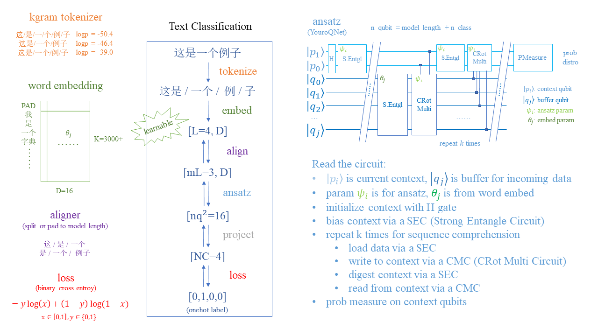

# YouroQNet: Quantum Text Classification with Context Memory

    Official implementaion of YouroQNet, a toyish quantum text classifier implemented with pyVQNet and pyQPanda

----

This repo contains code for the final problem of the OriginQ's [2nd CCF "Pilot Cup" contest](https://contest.originqc.com.cn/contest/4/contest:introduction) (Professional Group - Quantum Machine Learning Track).

> Oh yes yes child, we've run a hard time struggling.

The final total score is **79.2**, and ranking unknown; but why the fuck you owe me a point of 0.8?? 🐱

And, code repo for the qualifying stage is here: [第二届“司南杯”初赛](https://github.com/Kahsolt/CCF-2nd-Pilot-Cup-first-stage)





### Quickstart

⚪ install

- `conda create -n q python==3.8` (pyvqnet requires Python 3.8)
- `conda activate q`
- `pip install -r requirements.txt`

⚪ for contest problem (👈 **Follow this to reproduce our contest results!!**)

- `python answer.py` for preprocess & train (⚠ VERY VERY SLOW!!)
- `python check.py` for evaluate

⚪ for quick peek of YouroQNet components

- `python vis_tokenizer.py` for adaptive k-gram tokeinzer interactive demo
- `python vis_youroqnet.py` for YouroQNet interactive demo
  - `run_quantum_toy.cmd` (👈 run the toy version out of box before all)

⚪ for full development

- download the full dataset [simplifyweibo_4_moods](https://github.com/SophonPlus/ChineseNlpCorpus/blob/master/datasets/simplifyweibo_4_moods/intro.ipynb), unzip `simplifyweibo_4_moods.csv` to `data` folder
- `pip install -r requirements_dev.txt` for extra dependencies
- `pushd repo & init_repos.cmd & popd` for extra git repos
  - fasttext==0.9.2 requires numpy<1.24 (things might changed)
- `start_shell.cmd` to enter deveolp run command env
  - `start_shell.cmd py` to get a ipy console that quick refering to `pyvqnet`'s fucking undocumented-documentation with `help()`
- `mk_preprocess.cmd` for making clean datasets, stats, plots & vocabs etc... (~7 minutes)
- `python vis_project.py` to see 3d data projection (you will understand what the fuck this dataset is 👿)
- `run_baseline.cmd` to run classic models
- `run_quantum.cmd` to run quantum models

⚠ The training sometimes might fail due to ill random parameter initialization, when trainset loss not tends to decay or quickly go overfit, just kill it & retry 😅

⚪ core idea & contributions

- adaptive k-gram tokenizer (see [mk_vocab.py](mk_vocab.py), interactivate demo [vis_tokenizer.py](vis_tokenizer.py))
- YouroQNet for text clf (see [run_quantum.py](run_quantum.py), interactivate demo [vis_youroqnet.py](vis_youroqnet.py))
- theoretical analysis of why & how QNN works (see [vis_qc_apriori.py](vis_qc_apriori.py))

ℹ See our PPT [YouroQNet.pdf](ref/YouroQNet.pdf) for more conceptual understanding 🎉


#### Dataset

A subset from [simplifyweibo_4_moods](https://github.com/SophonPlus/ChineseNlpCorpus/blob/master/datasets/simplifyweibo_4_moods/intro.ipynb): `1600` samples for train, `400` samples for test. Class label names: `0 - joy`, `1 - angry`, `2 - hate`, `3 - sad`, however is not very semantically corresponding in the datasets :(

⚠ File naming rule: `train.csv` is train set, `test.csv` is valid set, and the generated `valid.csv` might be the real test set for this contest. **We use csv filename to refer to each split in the code**


### Todo List

- [x] data exploration
  - [x] guess the target test set (`valid.txt`)
  - [x] vocab & freq stats
  - [x] pca & cluster
  - [ ] data relabel (?)
- [ ] data filtering
  - [x] punctuation sanitize
  - [ ] stop words removal
  - [x] too short / long sententce
- [x] feature extraction
  - [x] tf-idf (syntaxical)
  - [x] fasttext embedding (sematical)
  - [x] adaptive tokenizer
- [x] baseline models
  - [x] sklearn
  - [x] vqnet-classical
- [ ] quantum models
  - [ ] quantum embedding
  - [ ] model route on different length
  - [x] multi to binary clf
  - [ ] contrastive learning
  - [ ] learn the difference


### Project layout

```python
# meterials
ref/                # thesis for dev
  Question-ML.png   # problem sheet
  YouroQNet.pdf     # solution PPT (YouroQNet)
  init_thesis.cmd   # thesis donwloader
repo/               # git repos for research
  init_repos.cmd    # git repo cloner
  update_repos.cmd
data/               # dataset
  simplifyweibo_4_moods.csv   # raw dataset (manually download)
  train|test.csv    # context dataset
  *_cleaned.csv
  *_tokenized.txt
  cc.zh.300.bin     # FastText pretrained word embedding (auto downloaded)
log/                # outputs
  <analyzer>/       # aka. vocab
    <feature>/      # sklearn models
    <model>/        # vqnet/torch models
tmp/                # generated intermediate results for debug

# contest related
answer.py           # run script for preprocessing & training
check.py            # run script for evalution

# preprocessors
mk_*.py
mk_preprocess.cmd   # run script for mk_*.py

# models
run_baseline_*.py   # classical experiments
run_baseline.cmd    # run script for run_baseline_*.py
run_quantum.py      # quantum experiments
run_quantum.cmd     # run script for run_quantum.py
run_quantum_toy.cmd # toy QNN for debug and verify

# misc
vis_*.py            # intercative demos or debug scaffolds
utils.py            # common utils
start_shell.cmd     # develop env entry

# doc & lic
README.md
TECH.md             # techincal & theoretical stuff
requirements_*.txt
LICESE
```

ℹ For the contest, only these files are submitted: `answer.py`, `mk_vocab.py`, `run_quantum.py`, `utils.py`, `README.md`; it should be enough to run all quantum parts 😀


### References

- FastText: 
  - Enriching Word Vectors with Subword Information: [https://arxiv.org/abs/1607.04606](https://arxiv.org/abs/1607.04606)
  - Bag of Tricks for Efficient Text Classification: [https://arxiv.org/abs/1607.01759](https://arxiv.org/abs/1607.01759)
  - repo: [https://github.com/facebookresearch/fastText](https://github.com/facebookresearch/fastText)
- QNN for text-clf:
  - QNLP-DisCoCat: [https://arxiv.org/abs/2102.12846](https://arxiv.org/abs/2102.12846)
  - QSANN: [https://arxiv.org/abs/2205.05625](https://arxiv.org/abs/2205.05625)
- OriginQ: [https://originqc.com.cn/index.html](https://originqc.com.cn/index.html)
  - QPanda: [https://github.com/OriginQ/QPanda-2](https://github.com/OriginQ/QPanda-2)
  - pyQPanda: [https://pyqpanda-toturial.readthedocs.io/zh/latest/](https://pyqpanda-toturial.readthedocs.io/zh/latest/)
  - pyVQNet: [https://vqnet20-tutorial.readthedocs.io/en/main/index.html](https://vqnet20-tutorial.readthedocs.io/en/main/index.html)
- QCNN related:
  - tensorflow-quantum impl: [https://www.tensorflow.org/quantum/tutorials/qcnn](https://www.tensorflow.org/quantum/tutorials/qcnn)
  - pytorch + qiskit impl: [https://github.com/YPadawan/qiskit-hackathon](https://github.com/YPadawan/qiskit-hackathon)
  - pytorch + pennylane impl: [https://github.com/christorange/QC-CNN](https://github.com/christorange/QC-CNN)
- Tiny-Q: [https://github.com/Kahsolt/Tiny-Q](https://github.com/Kahsolt/Tiny-Q)

=> find thesis of related work in [ref/init_thesis.cmd](ref/init_thesis.cmd)  
=> find implementations of related work in [repo/init_repos.cmd](repo/init_repos.cmd)  


### Citation

If you find this work useful, please give a star ⭐ and cite~ 😃

```
@misc{kahsolt2023,
  author = {Kahsolt},
  title  = {YouroQNet: Quantum Text Classification with Context Memory},
  howpublished = {\url{https://github.com/Kahsolt/YouroQNet}}
  month  = {May},
  year   = {2023}
}
```

----
by Armit
2023/05/03 
