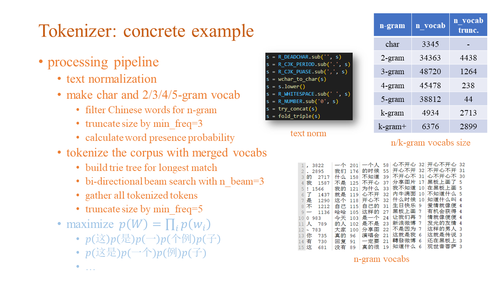
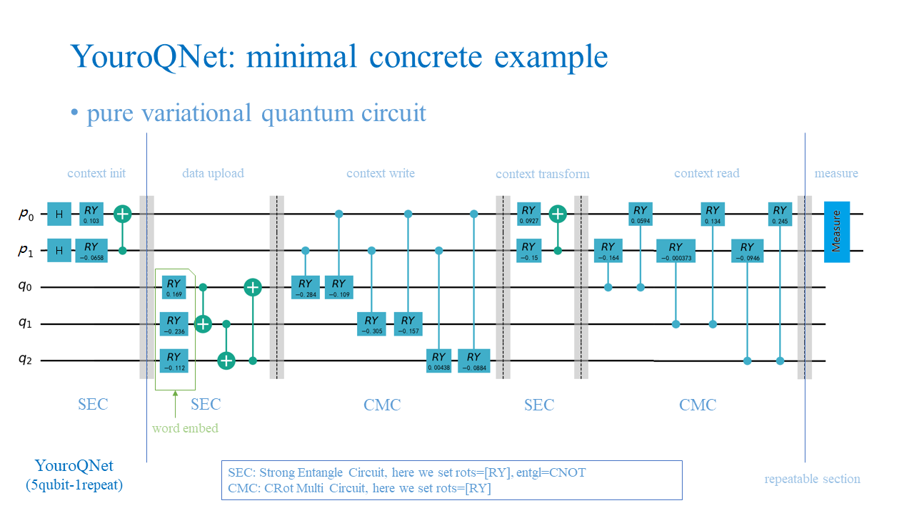
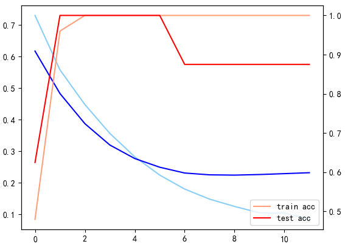
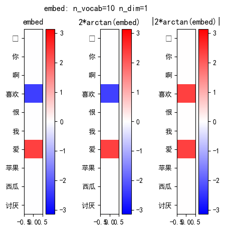
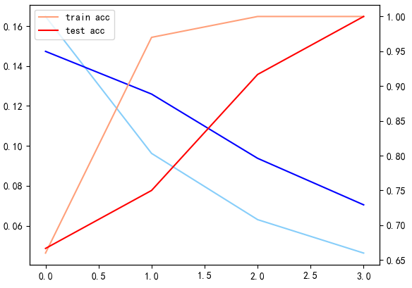
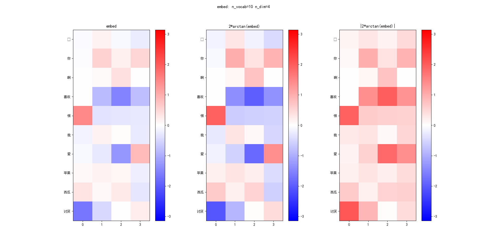

# YouroQNet: Quantum Text Classification with Context Memory

    Aiming to process quantum sequence data for NLP-like tasks, we propose the adaptive k-gram tokenizer and a pure quantum neural network (YouroQNet). 
    Experiments and theoretical analysis are also provided for further discussion and research.

----

### Problem

The given problem is a 4-classes text classification on a subset of the Chinese sentiment corpus [simplifyweibo_4_moods](https://github.com/SophonPlus/ChineseNlpCorpus/blob/master/datasets/simplifyweibo_4_moods/intro.ipynb). Available training set contains 1600 samples in various lengths ranging from 2 to more than 250 chars, while testing set contains 400 samples.

Exampes: (`0 - joy, 1 - angry, 2 - hate, 3 - sad`)

```
label,text
0,個 女仲笑淫淫果下甘先抵死: 哈哈啊哈！！！！！！！！！！！哥……轻点……
1,那我肯定气炸了。。。“你回家洗洗不就行了！”
2,想哭就大聲 哭！紙 巾夠 不夠 ？莫名地。。。。。豆大的眼泪蹦出来了！！！
3,我也感觉到啦啊啊操，，躺在床上感觉床晃了好几下，很剧烈，我马上跳了起来，听到人家说，是不是地震啊。。怕怕。
```

This concrete task is **extremely hard** to tackle, due to the reasons below:

- The texts are messy with emojis, multi-lingual, inconsistent and informal in pragmatics; see 👉 [dataset-projection](#dataset-projection)
- The texts are var-lengthed, hard to model a "global-scope"
- The dataset quantity is not enough to cover its word dictonary in semantics (1.6k sentences, but ~4k tokens in vocabulary)
- Classical methods show poor performance on it; see 👉 [classical-baseline-methods](#classical-baseline-methods)
- QNN training is very very very slow 😴


### Solution

Nevertheless, we still struggle to give a seemingly promising solution towards it, namely the **YouroQNet** architecture: 👇


Following the NLP tradition, we need a **tokenizer**, a **feature extractor** and **feature transformation model** to accompilish the classification mission. Therefore, in our solution for the contest, we design an adaptive k-gram tokenizer for sentence tokenizing, use a learnable embedding table as the feature extractor, and design the pure quantum model YouroQNet for feature transformation. Here's the workflow step by step explained:

- `tokenize`: tokenize the given sentence with the adaptive k-gram tokenizer
- `embed`: lookup the tokens in the embedding table to get the learned word-embedding as input features
- `align`: align the input length to match model length
- `ansatz`: forward the YouroQNet with the inputs to get the predicted class-wise probability distribution
- `project & loss`: for back-propagation to optimize the ansatz parameters

Repeat, our most important contributions are listed below:

- propose the [adaptive k-gram tokenizer](#adaptive-k-gram-tokenizer) for heuristical text tokenizing in a self-supervised manner
- propose the [YouroQNet](#youroqnet) model for quantum sequence processing
- conduct various experiments on a toy dataset to [verify capabilty](#capability-verification) of YouroQNet
- give a brief [theoretical analysis](#theoritical-analysis) on why and how YouroQNet works

Following four sections will discuss them in details sequentially, or you can just make a jump follow the links. 😀

----

### Adaptive k-gram Tokenizer

Tokenizer is a common and basic preprocessor for textual processings, and necessary for make a learnable embedding table, we design an adaptive k-gram tokenizer which can heuristically tokenize words in a self-supervised manner. 

The main task is to **bootstrap a vocabulary book** with most frequent k-grams recognised as a work (or token), follow these steps to achieve it: 👇



Then any sentence can be tokenized using a **bidirectional longest-match with beam search** strategy referring to this code book, and pick the solution with the highest log-porb as final decision.


### YouroQNet

Following the **style-transfer schema** but implemented in a quantum manner, using an extra quantum register as the **context memory**, we design the pure quantum neural network model YouroQNet for quantum sequence processing. The abstract architecture is shown in section [Solution](#solution), here we present a minial concrete example of YouroQNet (namely **YouroQNet_toy**): 👇



Read the YouroQNet circuit step by step:

- |𝑝⟩ is current context, |𝑞⟩ is buffer for incoming data
- param 𝜓 is for ansatz, 𝜃 is from word embed
- initialize context with H gate
- bias context via a SEC (Strong Entangle Circuit)
- repeat k times for sequence comprehension
  - load data via a SEC
  - write to context via a CMC (CRot Multi Circuit)
  - digest context via a SEC
  - read from context via a CMC
- perform pmeasure on the context qubits


### Evaluation

For the contest problem with given dataset, we train our model using following command and configurations:

- `python answer.py`

```json
{
  "analyzer": "kgram",
  "pad": "\u0000",
  "min_freq": 10,
  "limit": -1,
  "model": "YouroQ",
  "n_len": 8,
  "n_class": 4,
  "n_repeat": 4,
  "embed_avg": 0.0,
  "embed_var": 0.2,
  "embed_norm": 1,
  "SEC_rots": "RY",
  "SEC_entgl": "CNOT",
  "CMC_rots": "RY",
  "init_H": false,
  "init_H_p": true,
  "init_H_q": false,
  "noise": 1e-05,
  "alt": false,
  "alt_step": 10,
  "optim": "Adam",
  "grad_meth": "fd",
  "grad_dx": 0.01,
  "lr": 0.01,
  "epochs": 4,
  "batch_size": 4,
  "slog_interval": 10,
  "log_interval": 50,
  "n_vote": 5,
  "seed": 10141,
  "inspect": false,
  "debug_step": false,
  "binary": false,
  "tgt_cls": 0,
  "onehot": true,
  "proj": "onehot",
  "expname": "kgram_YouroQ",
  "out_dp": "log\\kgram\\YouroQ",
  "n_vocab": 1244,
  "n_qubit_p": 4,
  "n_qubit_q": 8,
  "n_qubit": 12,
  "n_param_tht": 4976,
  "n_param_psi": 276,
  "n_param": 5252,
  "embed_dim": 4,
  "mnet": false,
  "param_cnt": 5252
}
```

Then perform evaluation on inplacely on the contest dataset, here's the results:

| F1-score | train | test | valid |
| :-: | :-: | :-: | :-: |
| cls-0 | 0.071  | 0.018  | 0.053 |
| cls-1 | 0.352  | 0.342  | 0.362 |
| cls-2 | 0.205  | 0.22   | 0.175 |
| cls-3 | 0.351  | 0.273  | 0.254 |
|  avg  | 0.2448 | 0.2133 | 0.211 |

ℹ We make the valid set by `valid = total - train - test`
⚠ Although the evalution results seems ridiculous, we argue that it's the dataset's fault rather than us YouroQNet 🙄

To frankly demonstrate the real capability of YouroQNet, read the following two sections:

- [Capability Verification](#capability-verification) will given ablation studies on a hand-craft small dataset, showing that the learned embedding can be interpretible through visualization; and should be promising to fit larger datatsets if the quantum circuit is deep enough
- [Theoritical Analysis](#theoritical-analysis) will give a formal model to depict YouroQNet's mathematical a priori structure, and indicating the capability upper bounds of other general QNNs 😀


### Capability Verification

We conduct many toy experiments to demonstrate what YouroQNet could promise. 🎉

⚪ binary classification

Use the simple `YouroQNet_toy` architecture mentioned [above](#youroqnet), we starts from a toy 2-class dataset.

```python
train_data = [
  (0, '我爱你'),
  (0, '我喜欢苹果'),
  (0, '苹果啊喜欢'),
  (0, '你爱西瓜'),
  (1, '你讨厌我'),
  (1, '讨厌西瓜苹果'),
  (1, '你讨厌苹果'),
  (1, '我恨啊恨'),
]
test_data = [
  (0, '西瓜喜欢'),
  (0, '我喜欢喜欢'),
  (0, '苹果爱'),
  (0, '你爱我'),
  (1, '讨厌你'),
  (1, '讨厌苹果'),
  (1, '恨你'),
  (1, '啊恨啊'),
]
words = {
  # positive (leading to class 0)
  '爱', '喜欢',
  # negative (leading to class 1)
  '恨', '讨厌',
  # neutral
  '啊', '我', '你', '苹果', '西瓜',
}
```

Train the model with `words` as the custom vocabulary, we get meaningful results to successfully separate `爱/喜欢` from `恨/讨厌`:

- the loss curve shows that QNN can generalize to some degree, but still may suffer from overfitting like in classical networks
- the embed heatmap shows that `爱/喜欢` are highlighted out, the others are grouped as one; and note that **only absolute value makes difference** to our QNN, the intrinsic reason will be partially revealed in the next section [Theoritical Analysis](#theoritical-analysis) 😆

| loss & acc | embedding |
| :-: | :-: |
|  |  |


⚪ dataset bias

To further test why `爱/喜欢` are highlighted out rather than `恨/讨厌`, we add more data points to **bias the neutral words** towards positive or negative side:

```python
b = 0   # 0 (bias pos) or 1 (bias neg)
baised_data = [
  (b, '我你'),
  (b, '你啊'),
  (b, '啊我啊啊'),
  (b, '西瓜苹果'),
  (b, '你西瓜'),
  (b, '我苹果啊'),
]
```

Now we could compare the behaviour, and find that the model tends to **highlight the minority**, which is also reasonable for us human:

- When dataset biased to the positive, which means more words should appear in class-0, so the minority `恨/讨厌` would be picked out
- When dataset biased to the negative, just on the contrary, `爱/喜欢` gets prominent
- And also, when dataset not biased, the dataset statistics itself should decide the bias

| bias | positive | negative |
| :-: | :-: | :-: |
| loss & acc |  |  |
| embedding  |  |  |


⚪ extends to 3-classes classification

Further more, we can mark the neutral words as class-2 to make a 3-class clf task:

```python
train_data_cls2 = [
  (2, '啊你我'),
  (2, '西瓜苹果'),
  (2, '你苹果'),
  (2, '我啊'),
]
test_data_cls2 = [
  (2, '苹果啊'),
  (2, '西瓜我西瓜'),
  (2, '啊啊啊'),
  (2, '你我'),
]
```

The learning is harder, but still successfull to emphasize `爱/喜欢` and `恨/讨厌` in different embedding dimensions `d0` and `d2~d3`, repectively:

| loss & acc | embedding |
| :-: | :-: |
|  |  |


### Theoritical Analysis

As we know, quantum gates are unitary matrices in math. So to describe QNNs in a pure mathematical way, just do computations in the matrix form and try symbolically simply it, brute-forcely...  
👉 Read the Appendix section [model-a-priori](#model-a-priori) to get an idea on our implementation.

⚪ single-qubit RX-RY-RZ rotation

First, consider the expressivity of a single-qubit RX-RY-RZ rotation circuit, which is the fundament of many data-encoding circuits, also be a part of the Strong Entangle Circuit.

```python
# the single-qubit data encoder:
#  - 1 qubit
#  - 1~3 param
#  - rotate with RX/RY/RZ
#  - no entangle
# circuit:     c0         c1         c2
#          ┌────────┐ ┌────────┐ ┌────────┐ 
# q_0: |0>─┤RX(tht0)├─┤RY(tht1)├─┤RZ(tht2)├─
#          └────────┘ └────────┘ └────────┘ 

# coeffs on:
# |0>: ( I*sin(θ_0/2)*sin(θ_1/2) + cos(θ_0/2)*cos(θ_1/2))*exp(-I*θ_2/2)
# |1>: (-I*sin(θ_0/2)*cos(θ_1/2) + sin(θ_1/2)*cos(θ_0/2))*exp( I*θ_2/2)

# probs on:
# |0>:  0.5*cos(θ_0)*cos(θ_1) + 0.5
# |1>: -0.5*cos(θ_0)*cos(θ_1) + 0.5
```

Now, run the circuit to get coefficients of the final quantum state, and also the PMeasure probabilities under computational basis. Here's the obvious conclusions:

- `RZ(θ_2)` make no effects, because **relative phase is indistinguishable** for PMeasure under computational basis
- `RX` and `RY` are symmetrical and replacible by each other, again because relative phase is useless
- the result is a 2D hyperbolic surface: when `θ_0/θ_1` is both large or small, the mapped target value is large, otherwise is small; hence this functions can **indicate the linear correlationship of the inputs**
- the intrinsic model is a triangle series all about `cos`, they are all even, which should probably answer the question in section [capability-verification](#capability-verification) why **only absolute value of the inputs makes difference**

⚪ YouroQNet_toy (binary)

Now, we get to point out what the hell is the mathematical form of YouroQNet, to make formula even shorter, we consider the binary version of YouroQNet_toy, which use a single-qubit as context `|p>`. 

```python
# the YouroQNet toy (binary):
#  - 4 qubits
#  - 11 param (tht=3, psi=8)
#  - rotate with RY
#  - entangle with CNOT / CRY
# circuit:     c0       c1     c2     c3      c4         c5         c6         c7         c8         c9         c10
#          ┌────────┐                                                       ┌────────┐ ┌────────┐ ┌────────┐ ┌────────┐
# q_0: |+>─┤RY(psi0)├ ────── ────── ────── ────■───── ────■───── ────■───── ┤RY(psi4)├ ┤RY(psi5)├ ┤RY(psi6)├ ┤RY(psi7)├
#          ├────────┤               ┌────┐ ┌───┴────┐     │          │      └────────┘ └────┬───┘ └───┬────┘ └───┬────┘
# q_1: |0>─┤RY(tht0)├ ───■── ────── ┤CNOT├ ┤RY(psi1)├ ────┼───── ────┼───── ────────── ─────■──── ────┼───── ────┼─────
#          ├────────┤ ┌──┴─┐        └──┬─┘ └────────┘ ┌───┴────┐     │                                │          │
# q_2: |0>─┤RY(tht1)├ ┤CNOT├ ───■── ───┼── ────────── ┤RY(psi2)├ ────┼───── ────────── ────────── ────■───── ────┼─────
#          ├────────┤ └────┘ ┌──┴─┐    │              └────────┘ ┌───┴────┐                                      │
# q_3: |0>─┤RY(tht2)├ ────── ┤CNOT├ ───■── ────────── ────────── ┤RY(psi3)├ ────────── ────────── ────────── ────■─────
#          └────────┘        └────┘                              └────────┘                

# coeff α on component α|0000> (eqv. matrix cell of qc[0, 0]):
# - sin(θ_0/2)*sin(θ_1/2)*sin(θ_2/2) * sin(ψ_0/2 + pi/4) * cos(ψ_1/2 + ψ_2/2)*cos(ψ_3/2) * sin(ψ_4/2)
# + sin(θ_0/2)*sin(θ_1/2)*cos(θ_2/2) * sin(ψ_0/2 + pi/4) * sin(ψ_1/2 + ψ_2/2)*sin(ψ_3/2) * sin(ψ_4/2)
# + cos(θ_0/2)*cos(θ_1/2)*sin(θ_2/2) * sin(ψ_0/2 + pi/4) * sin(ψ_1/2 + ψ_2/2)*cos(ψ_3/2) * sin(ψ_4/2) 
# - cos(θ_0/2)*cos(θ_1/2)*cos(θ_2/2) * sin(ψ_0/2 + pi/4) * cos(ψ_1/2 + ψ_2/2)*sin(ψ_3/2) * sin(ψ_4/2)
# + sin(θ_0/2)*sin(θ_1/2)*sin(θ_2/2) * cos(ψ_0/2 + pi/4)                                 * cos(ψ_4/2)
```

Run this circuit and perform PMeasure alike the former one, there are too many terms, we focus on the simplest (also the first) one. 
It looks more messy, but once noted that `sin/cos` are bounded and periodical, even when the `θ`s are restricted in range `[-pi/2, pi/2]` (in case as embedding), 
we could **use simple linear and quadratic to approximiate** the trigonometric fucntions.

- `sin(x)` could be approximated by `f(x) = 2.4 / pi * x`
- `cos(x)` could be approximated by `g(x) = 1 - (2 / pi * x)**2`

Simplify the results by approximation, we will get a more complicated stuff 😓, and more discoveries:

- it's a high order power function reaches `~ ^10` for both `ψ` and `θ`, nearly symmetrically
- parameters are mostly often to be compared with `pi`, in such terms like `(ψ_4**2-C), (θ_0**2-C)` where `C = pi**2`, or just left single; this is also **where the non-linearity comes from** in this computaional structure

```python
# (
# -0.85*pi**6 *  ψ_0      *(ψ_4**2-C) * (θ_0**2-C)*(θ_1**2-C)*(θ_2**2-C)
# -0.71*pi**5 * (ψ_0**2-C)*(ψ_4**2-C) * (θ_0**2-C)*(θ_1**2-C)*(θ_2**2-C)
# -2.21*pi**5 *  ψ_0      * ψ_4       *  θ_0        * θ_1        * θ_2         * ψ_3      *(1.44*C*ψ_1*ψ_2-(ψ_1**2-C)*(ψ_2**2-C))
# +1.76*pi**4 * (ψ_0**2-C)* ψ_4       *  θ_0        * θ_1        * θ_2         * ψ_3      *(1.44*C*ψ_1*ψ_2-(ψ_1**2-C)*(ψ_2**2-C))
# -1.76*pi**4 *  ψ_0      * ψ_4       * (θ_0*θ_1*(θ_2**2-C)*(ψ_3**2-C)-θ_2*ψ_3*(θ_0**2-C)*(θ_1**2-C)) * ψ_1*(ψ_2**2-C) + ψ_2*(ψ_1**2-C)) 
# +1.47*pi**3 * (ψ_0**2-C)* ψ_4       * (θ_0*θ_1*(θ_2**2-C)*(ψ_3**2-C)-θ_2*ψ_3*(θ_0**2-C)*(θ_1**2-C)) * ψ_1*(ψ_2**2-C) + ψ_2*(ψ_1**2-C))
# +1.02*pi    *  ψ_0      * ψ_4       * (θ_0**2-C)*(θ_1**2-C)*(θ_2**2-C)       *(ψ_3**2-C)*(1.44*C*ψ_1*ψ_2-(ψ_1**2-C)*(ψ_2**2-C)) 
# -0.85       * (ψ_0**2-C)* ψ_4       * (θ_0**2-C)*(θ_1**2-C)*(θ_2**2-C)       *(ψ_3**2-C)*(1.44*C*ψ_1*ψ_2-(ψ_1**2-C)*(ψ_2**2-C)) 
# )/pi**15, where C = pi**2

# Even further collapse all multiplier constants to get the functional form ——
# => Fold all `psi` to const, get the partial function form of f(tht):
#   f(tht) = (θ_0*θ_1 + (θ_0**2-C)*(θ_1**2-C)) * (θ_2 + (θ_2**2-C))
# where C are different consts
# now it's clear to see the charateristic function is a 3-variable power-6 polynomial function :)
# accordingly, the psi params controlls the coefficient of each term in a sophisticated way...
# => Fold all `tht` to const, get the partial function form of g(psi):
#   g(psi) = ((ψ_0**2-C)+ψ_0)*((ψ_4**2-C)+ψ_4*(((ψ_3**2-C)-ψ_3) * (ψ_1*(ψ_2**2-C) + ψ_2*(ψ_1**2-C))+(ψ_3+(ψ_3**2-C))*(ψ_1*ψ_2-(ψ_1**2-C)*(ψ_2**2-C))))
```

---- 

### Appendix

#### dataset projection

| PCA | T-SNE |
| :-: | :-: |
|  |  |

⚠ visualized projection of char-level tf-idf shows **very high entropy**, it even not indicating a basic kNN-conservative property!! 🙄

#### classical baseline methods

👉 Use tf-idf as input features, this should focus more on **syntactical** sense

| level | Class-wise F1 | Average F1 |
| :-: | :-: | :-: |
| char |  |  |
| word |  |  |

👉 Use pretrained [FastText]((https://github.com/facebookresearch/fastText)) word embedding as input features, this should focus more on **semantical** sense

| level | Class-wise F1 | Average F1 |
| :-: | :-: | :-: |
| char |  |  |
| word |  |  |

⚠ baselines statistical ML methods show **very poor performance**, merely better than random guess!!

#### model a priori

We perform matrix computations follow the syntax of [Tiny-Q](https://github.com/Kahsolt/Tiny-Q).  
The `run_circuit` code is trivial, and the gates (`RX, RY, RZ, CRY, I, H, SWAP`) are defined following Tiny-Q, but use `sympy` library for symbolic computation.  
We show only the circuit implementations here, the whole runnable code will be publically available after the contest closed. 😉

⚪ single-qubit RX-RY-RZ rotation

```python
def build_circuit(RX:Gate, RY:Gate, RZ:Gate) -> Gate:
  c0 = RX('θ_0')
  c1 = RY('θ_1')
  c2 = RZ('θ_2')
  qc = c2 @ c1 @ c0
  return qc
```

⚪ YouroQNet_toy (binary)

```python
def build_circuit(RY:Gate, CRY:Gate) -> Gate:
  # circuit axiliary
  I2 = get_I(2)
  I3 = get_I(3)
  swap01 = compose(SWAP, I2)
  swap12 = compose(I, SWAP, I)
  swap23 = compose(I2, SWAP)

  # circuit clocks
  c0  = compose(RY('ψ_0'), RY('θ_0'), RY('θ_1'), RY('θ_2'))
  c1  = compose(I, CNOT, I)
  c2  = compose(I2, CNOT)
  c3  = (swap12 @ swap23) @ compose(I2, CNOT) @ (swap23 @ swap12)
  c4  = compose(CRY('ψ_1'), I2)
  c5  = swap23 @ compose(CRY('ψ_2'), I2) @ swap23
  c6  = (swap23 @ swap12) @ compose(CRY('ψ_3'), I2) @ (swap12 @ swap23)
  c7  = compose(RY('ψ_4'), I3)
  c8  = swap01 @ compose(CRY('ψ_5'), I2) @ swap01
  c9  = (swap12 @ swap01) @ compose(CRY('ψ_6'), I2) @ (swap01 @ swap12)
  c10 = (swap23 @ swap12 @ swap01) @ compose(CRY('ψ_7'), I2) @ (swap01 @ swap12 @ swap23)

  # circuit (chaining up all gates)
  qc = c10 @ c9 @ c8 @ c7 @ c6 @ c5 @ c4 @ c3 @ c2 @ c1 @ c0 @ compose(H, I3)
  return qc
```

----

### References

- FastText: 
  - Enriching Word Vectors with Subword Information: [https://arxiv.org/abs/1607.04606](https://arxiv.org/abs/1607.04606)
  - Bag of Tricks for Efficient Text Classification: [https://arxiv.org/abs/1607.01759](https://arxiv.org/abs/1607.01759)
  - repo: [https://github.com/facebookresearch/fastText](https://github.com/facebookresearch/fastText)
- QNN for text-clf:
  - QNLP-DisCoCat: [https://arxiv.org/abs/2102.12846](https://arxiv.org/abs/2102.12846)
  - QSANN: [https://arxiv.org/abs/2205.05625](https://arxiv.org/abs/2205.05625)
- OriginQ: [https://originqc.com.cn/index.html](https://originqc.com.cn/index.html)
  - QPanda: [https://github.com/OriginQ/QPanda-2](https://github.com/OriginQ/QPanda-2)
  - pyQPanda: [https://pyqpanda-toturial.readthedocs.io/zh/latest/](https://pyqpanda-toturial.readthedocs.io/zh/latest/)
  - pyVQNet: [https://vqnet20-tutorial.readthedocs.io/en/main/index.html](https://vqnet20-tutorial.readthedocs.io/en/main/index.html)
- Tiny-Q: [https://github.com/Kahsolt/Tiny-Q](https://github.com/Kahsolt/Tiny-Q)

----
2023/05/24
